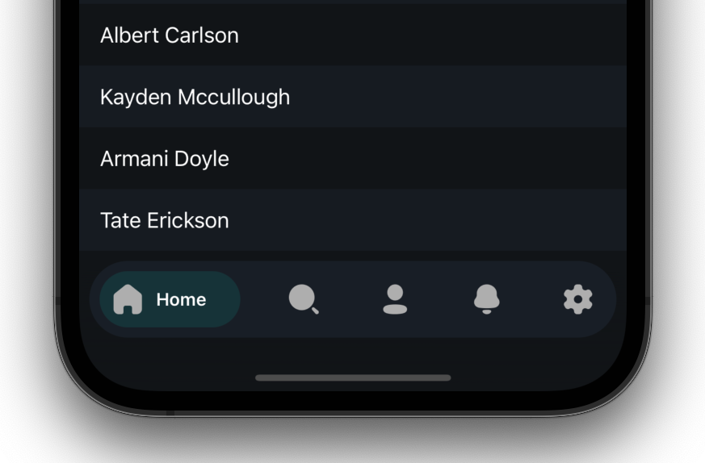

<br> 
<br> 
<p align="center">
    
</p>
<br> 
<br> 
<br> 
<p align="center">
    <a href="https://swift.org/package-manager/">
        
    </a>
    <a href="http://cocoapods.org/pods/RAMAnimatedTabBarController">
        
    </a>
    
	  <a href="https://twitter.com/yusadogru">
        
    </a>
</p>
<br> 
<p align="center">
  
  
</p>
<br> 

This library is for adding animation to iOS tabbar items, which is inherited from UITabBarController.
<br> 

## Installation

Just add the Sources folder to your project.

or use [CocoaPods](https://cocoapods.org) with Podfile:
``` ruby
pod 'CardTabBar'
```

or [Swift Package Manager](https://swift.org/package-manager/) 


## Usage

```swift
import CardTabBar

class TabBarController: CardTabBarController {

    override func viewDidLoad() {
        super.viewDidLoad()
        setupViewController()
        setupUI()
    }

    func setupUI() {
        tabBar.tintColor = .TabBar.title
        tabBar.backgroundColor = .background
        tabBar.barTintColor = .Navigation.background
        tabBar.indicatorColor = .TabBar.itemBackground
    }
    
    func setupViewController() {
        viewControllers = [UIViewController(), UIViewController()]
    }
}
```

<br> 
<br> 

<p align="center">
    
</p>

# License
The library is available as open source under the terms of the [MIT License](http://opensource.org/licenses/MIT).
